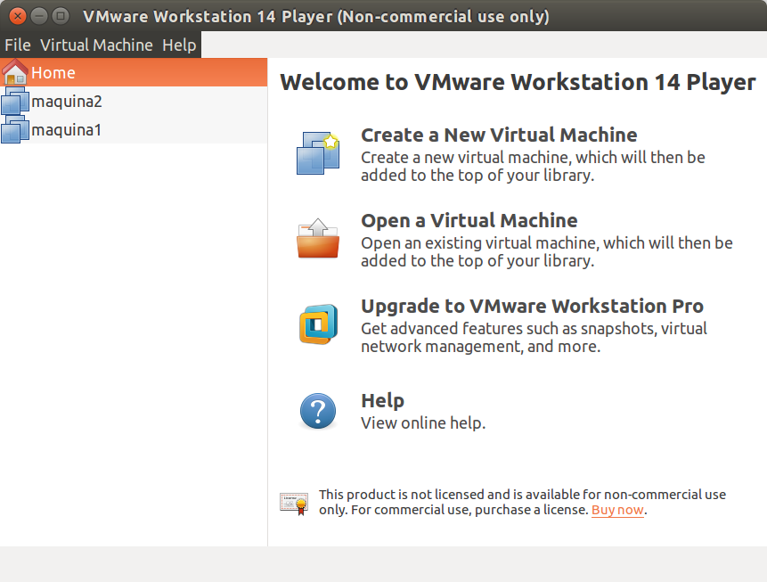

## Práctica 1 

### Instalación de maquinas virtuales
He instalado las dos máquinas virtuales utilizando VMware Player 

	

### Comprobamos la versión del servidor 
> apache2 -v 

	

### Creamos el archivo HTML hola.html en el directorio /var/www/html y accedemos a él usando cURL 
> curl http://localhost/hola.html 

	

