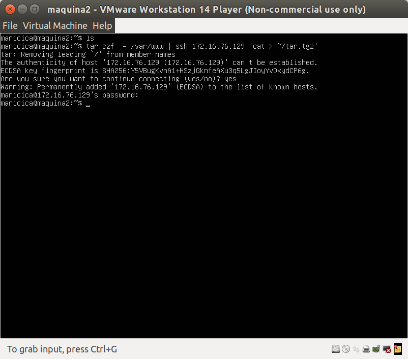
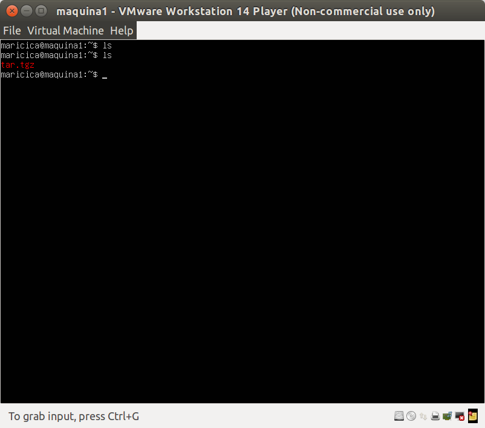
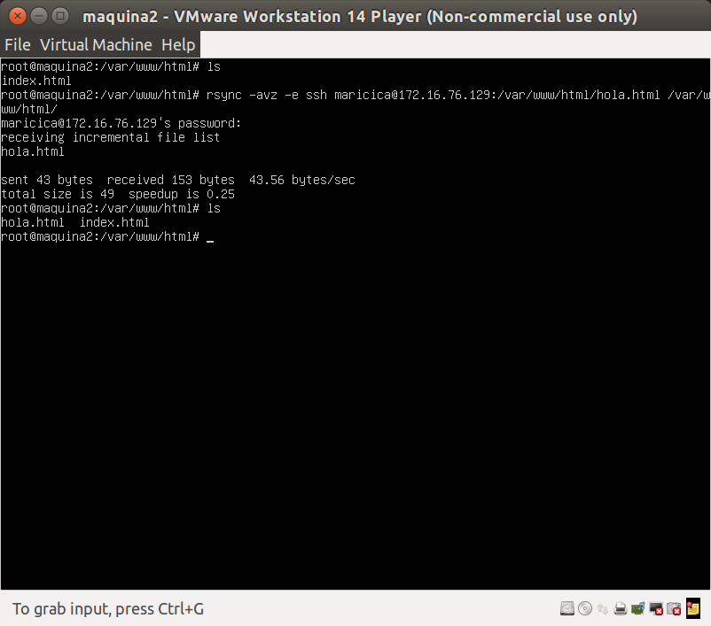
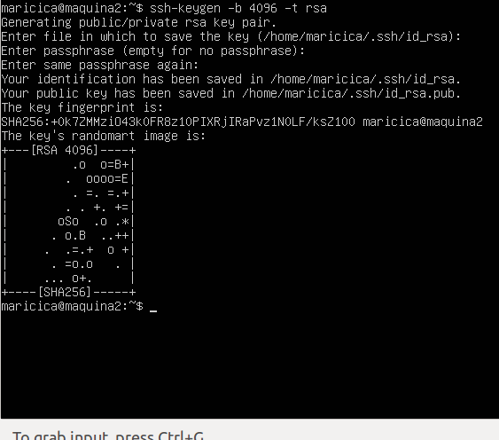
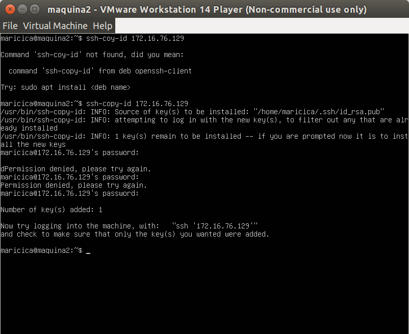
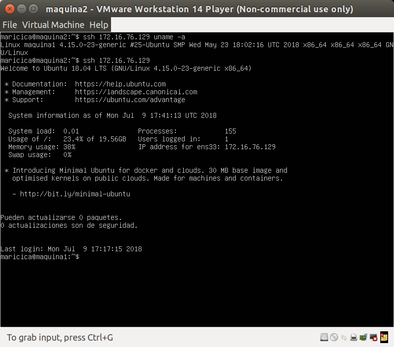
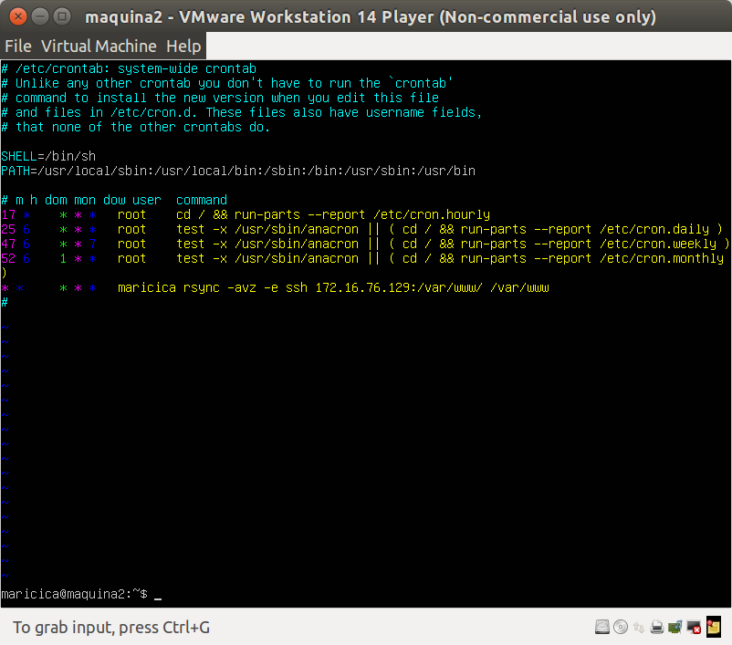

## Práctica 2 CLonar la información de un sitio web 

### Objetivos 
Los objetivos concretos de está práctica son:
- aprender a copiar archivos mediante ssh 
- clonar contenido entre máquinas
- configurar el ssh para acceder a máquinas remotas sin contraseña 
- establecer tareas en cron 

### Crear un tar con ficheros locales en un equipo remoto 
> tar czf -/var/www | ssh 172.16.76.129 'cat > ~/tar.tgz' 

	

	

### Instalar la herramienta rsync 
> sudo apt-get install rsync 

> rsync -avz -e ssh maricica:/var/www/ /var/www

	

### Acceso sin contraseña para ssh 

> shh-keygen -b 4096 -t rsa 

	

> ssh-copy-id 172.16.76.129

	

> ssh 172.16.76.129 uname -a 
> ssh 172.16.76.129 

	

### Programar tareas con crontab 

cron se ejecta en background y revisa cada minuto la tabla del fichero /etc/crontan en búsqueda de tareas que se debean ejecutar. 

Debemos editar el archvio /etc/crontab para programar una tarea que nos sincronice /var/www cada cierto tiempo. 

> sudo nano /etc/crontab 

	

