## Práctica 3. Balanceo de carga 

### Objetivos de la práctica 
En esta práctica configuraremos una red entre varias máquinas de forma que
tengamos un balanceador que reparta la carga entre varios servidores finales.

El problema a solucionar es la sobrecarga de los servidores. Se puede balancear
cualquier protocolo, pero dado que esta asignatura se centra en las tecnologías web, balancearemos los servidores HTTP que tenemos configurados.

De esta forma conseguiremos una infraestructura redundante y de alta disponibilidad.

### Alternativas para realizar balanceo de carga 
Para la realización de esta práctica debemos tener en ejecución las máquinas servidoras finales, las que hicimos en la anterior práctica que ejecutan el servidor Apache. También creamos una tercera máquina en la que no debe haber ningún software que se apropie del puerto 80, en esta máquina no debemos tener instalado Apache. 

En caso de tener instalado Apache ejecutamoe el siguiente comando 
> sudo update-rc.d apache2 remove 
Y para que ningún otro proceso ocupe el puerto 80, ejecutamos: 
> sudo fuser -k 80/tcp 

	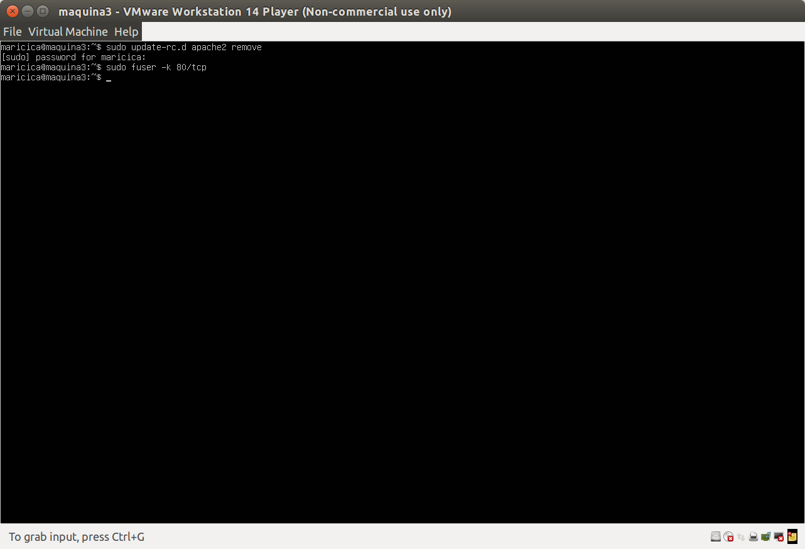

### El servidor web nginx 

Instalamos el servidor Nginx 

> sudo apt-get update && sudo apt-get dist-upgrade && sudo apt-get autoremove
> sudo apt-get install nginx 
> sudo systemctl start nginx 

	

#### Balanceador de carga usando nginx 
Tenemos que modificar el fichero de configuracuón /etc/ngingx/conf.d/default.conf 
y si este fichero no existe lo creamos 

	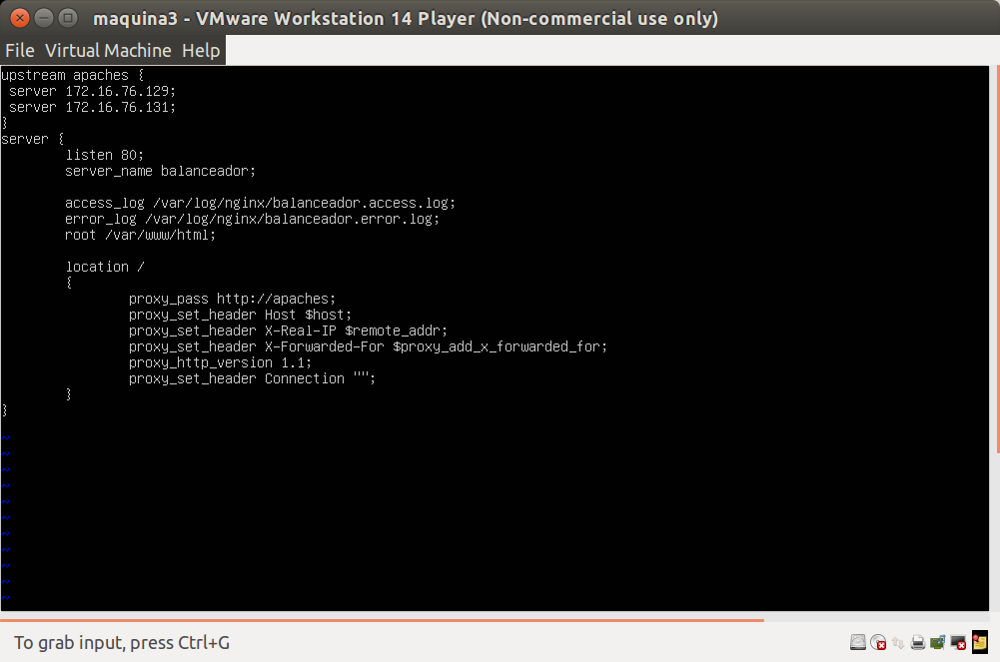

Una vez que lo tenemos configurado, podemos lanzar el servicio nginx 
> systemctl start nginx 

	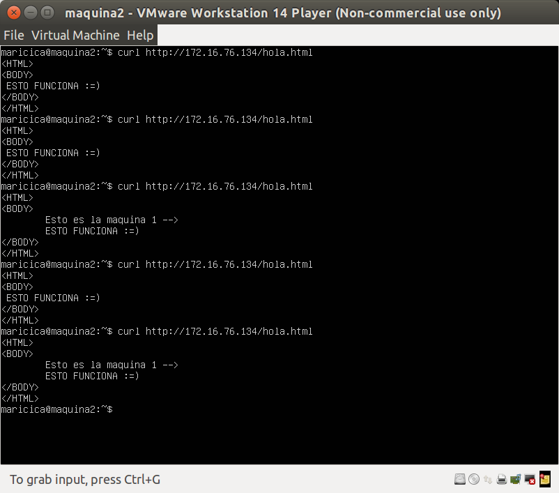

Hasta ahora lo hemos hecho sin priorizar ninguna máquina, usaremos "weight" para priorizar la máquina 1 

	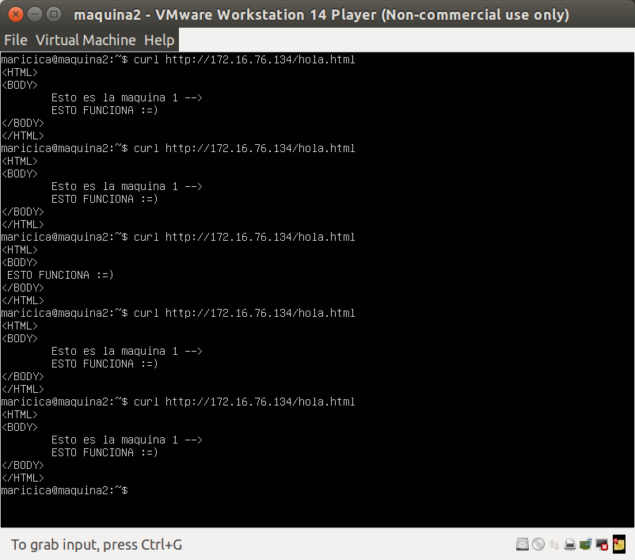

Si nos interesa que que todas las peticiones que vengan de la misma IP se dirijan a la misma máquina servidora final utilizaremos la directica ip_hash al definir el upstream: 

	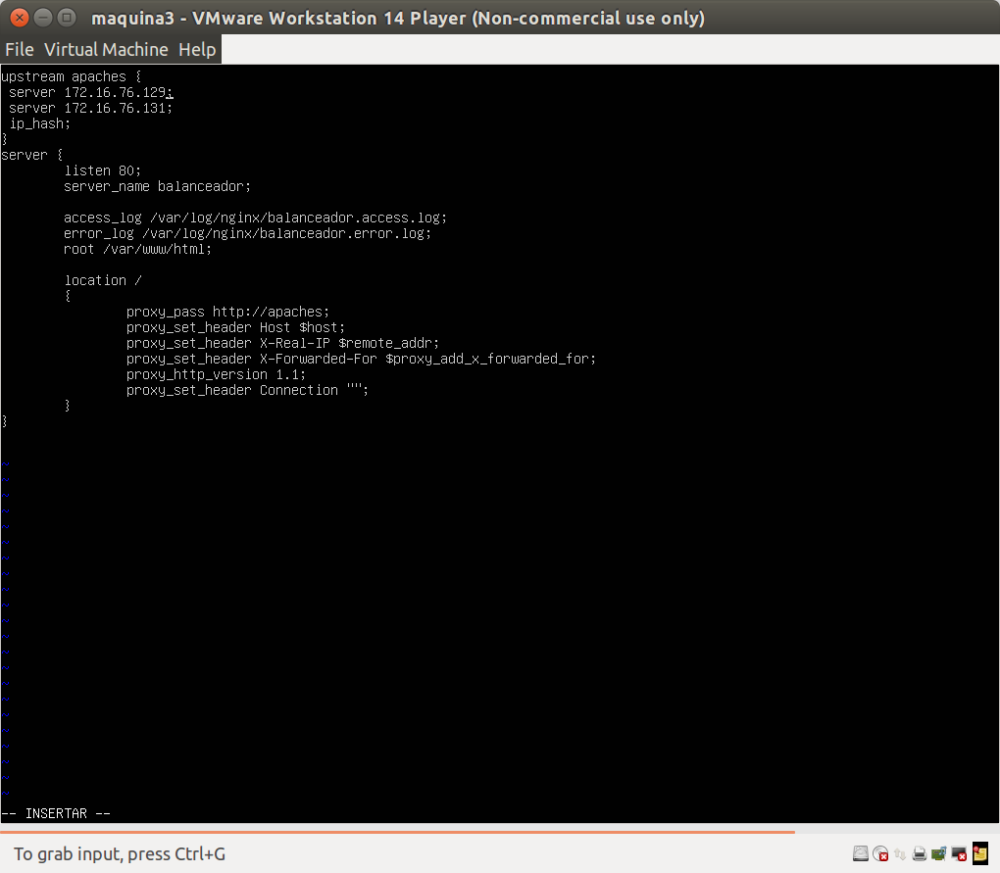

	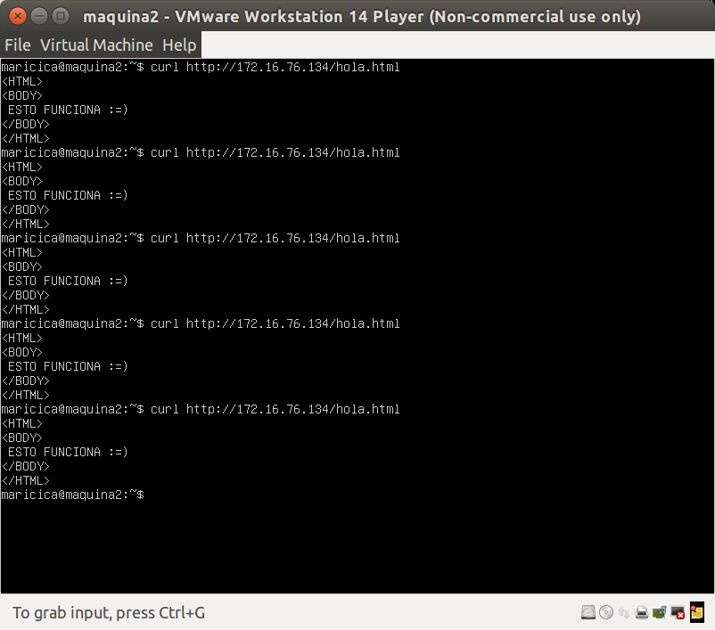

Paramos el servicio de nginx 
> sudo service nginx stop 

### Balanceo de carga con haproxy 

Instalamos haproxy 
> sudo apt-get install haproxy 

Configuramos haproxy como balanceador, /etc/haproxy/haproxy.cfg

	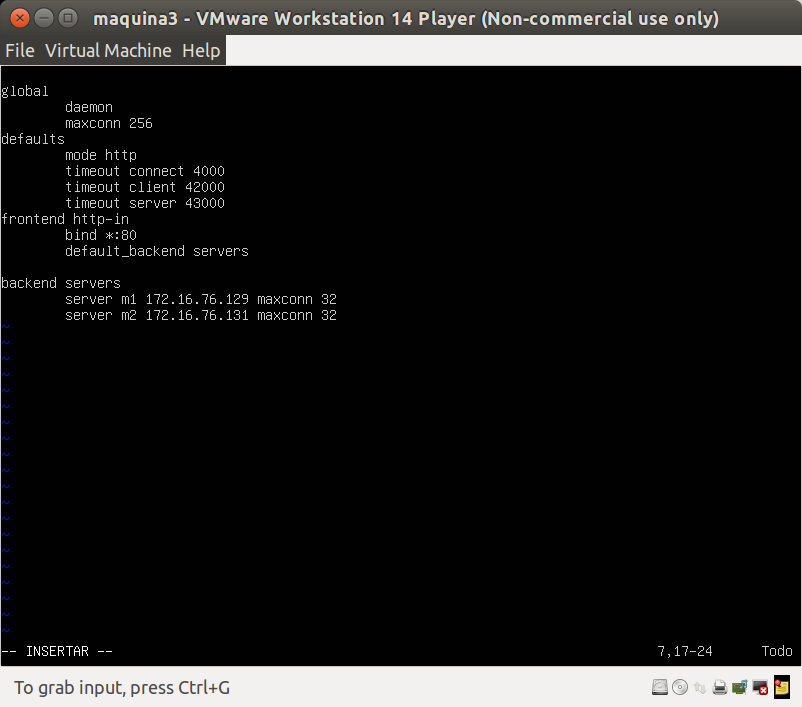

Activamos haproxy 
> /usr/sbin/haproxy -f /etc/haproxy/haproxy.cfg 

Probamos su funcionamiento siguiendo los pasos que hemos hecho con Nginx

	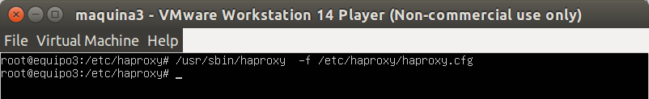

	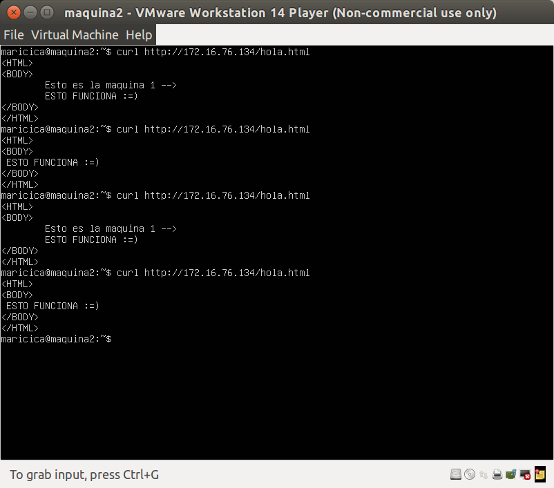

### Someter a una alta carga el servidor balanceado 

Instalamos Apache Benchmark 
> sudo apt-get install apache2-utils 

Ejecutamos el sigueinte comando para utilizar Apache Benchmark para someter a una carga muy alta a la granja web estando haproxy como balaceador 

> ab -n 1000 -c 10 http://172.16.76.134/hola

	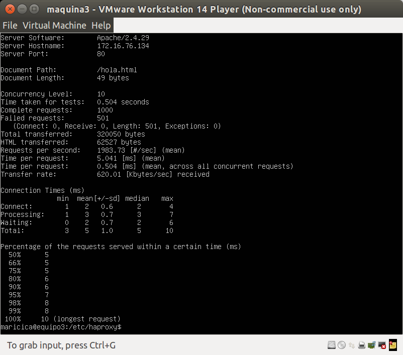

Ejecutamos el sigueinte comando para utilizar Apache Benchmark para someter a una carga muy alta a la granja web estando nginx como balaceador 

> ab -n 1000 -c 10 http://172.16.76.134/hola

	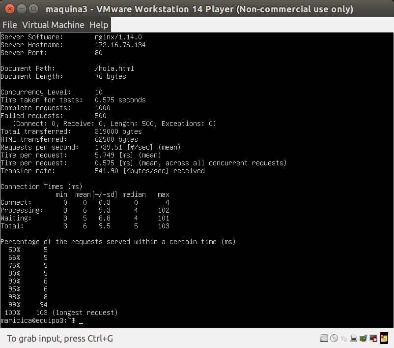

