## Práctica 4. Asegurar la granja web 

### Objetivos 
- Instalar un certificado SSL para configurar el acceso HTTPS a los servidores.
- Configurar las reglas del cortafuegos para proteger la granja web.

### Instalar un certificado SSL autofirmado para configurar el acceso por HTTPS

Vamos a habilitar el módulo SSL de Apache2 en las máquinas servidoras y en la maquina balanceadora. 

> sudo a2enmod ssl
> sudo service apache2 restart
> sudo mkdir /etc/apache2/ssl

	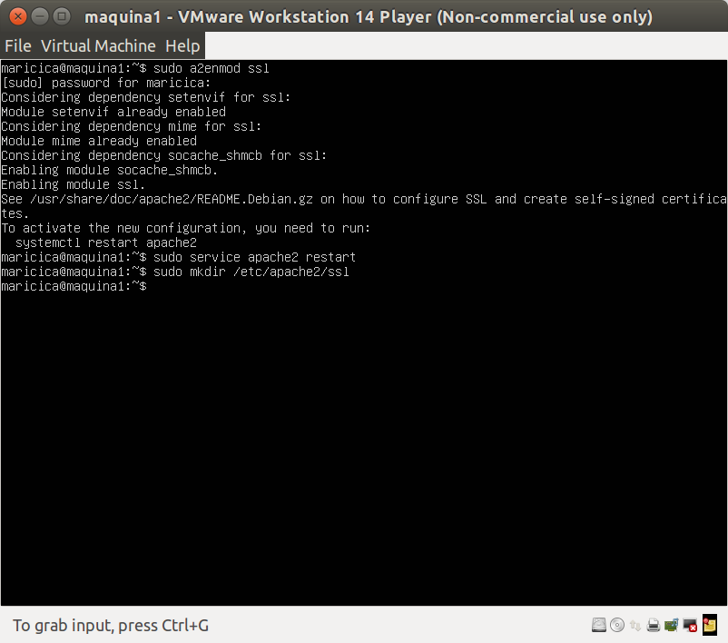

#### Máquina servidora 1 

> sudo openssl req -x509 -nodes -days 365 -newkey rsa:2048 -keyout /etc/apache2/ssl/apache.key -out /etc/apache2/ssl/apache.crt 

	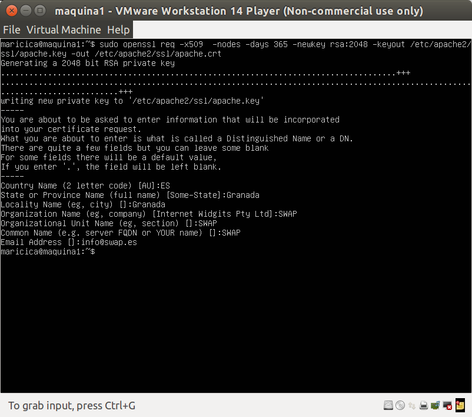

Editamos el archivo de configuración del sitio default-ssl 

> sudo vim /etc/apache2/sites-available/default-ssl 

Y agregamos estas lineas debajo de donde pone SSLEngine on : 

> SSLCertificateFile /etc/apache2/ssl/apache.crt
> SSLCertificateKeyFile /etc/apache2/ssl/apache.key

Activamos el sitio default--ssl y reiniciamos apache:
> a2ensite default-ssl
> service apache2 reload

	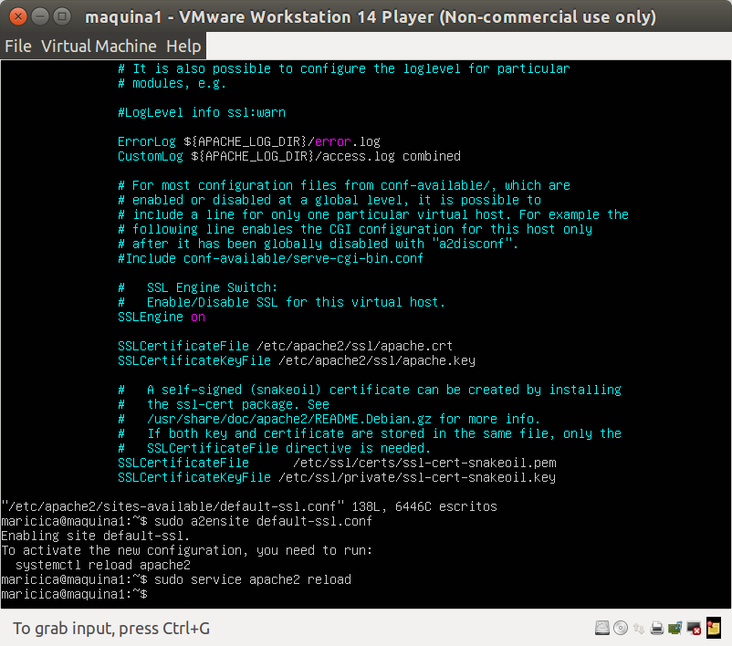

Una vez reiniciado Apache, accedemos al servidor web mediante el protocolo HTTPS
y veremos, si estamos accediendo con un navegador web, que en la barra de
dirección sale en rojo el https, ya que se trata de un certificado autofirmado.

Para hacer peticiones por HTTPS utilizando la herramienta curl, ejecutaremos:
> curl –k https://localhost/hola.html

	

#### Hablitar SSL en Apache y Nginx 
Una vez que tengamos acceso pot https en la máquina servidora 1, repetimos el mismo proceso para la máquina servidora 2 pero sin crear los certificados 

Para transferir los certificados usamos la herramienta scp, tambien se puede utilizar rsync. 

Desde la máquina 2:
> sudo scp maricica@172.16.76.129:/etc/apache2/ssl/* /etc/apache2/ssl/

	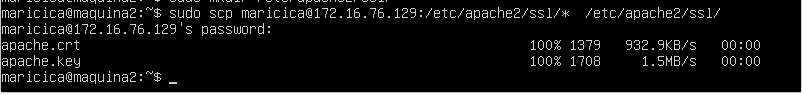

En la máquina 2 tenemos que activar el sitio default--ssl y reiniciamos apache:
> a2ensite default-ssl
> service apache2 reload

Desde la máquina 3 (balanceador): 

> sudo scp maricica@172.16.76.129:/etc/apache2/ssl/* /etc/nginx/ssl/

	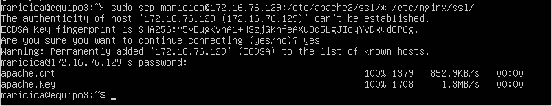

Para el balanceador, tenemos que habilitar ssl en Nginx, editamos el archivo /etc/nginx/conf.d/default.conf del balanceador (nginx) y añadimos lo siguiente:

	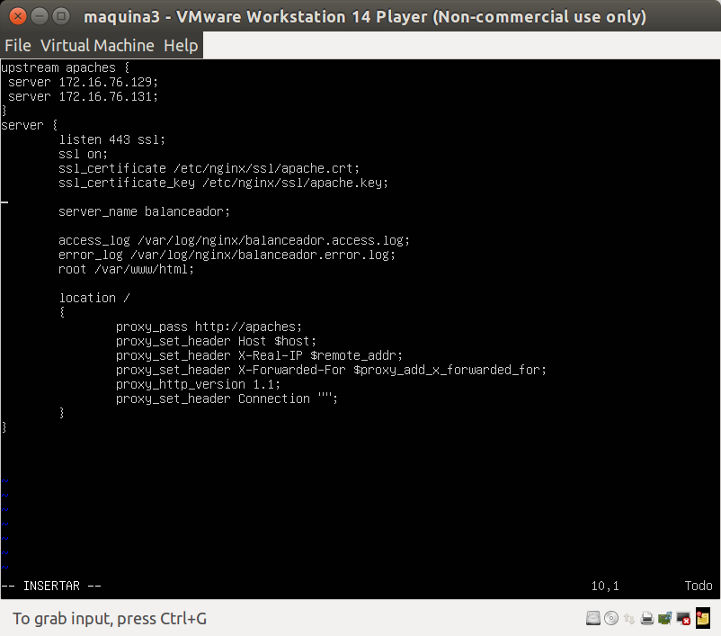

#### Máquina 1

Para hacer peticiones por HTTPS utilizando la herramienta curl, ejecutaremos:

	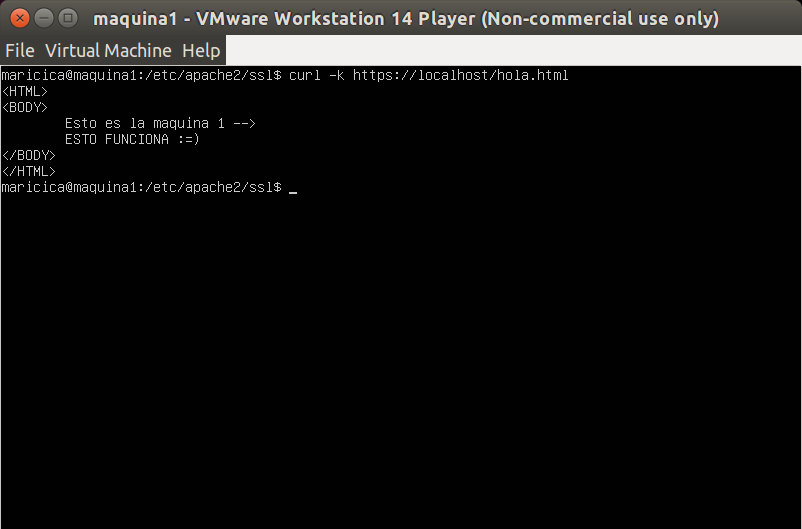

#### Máquina 2

	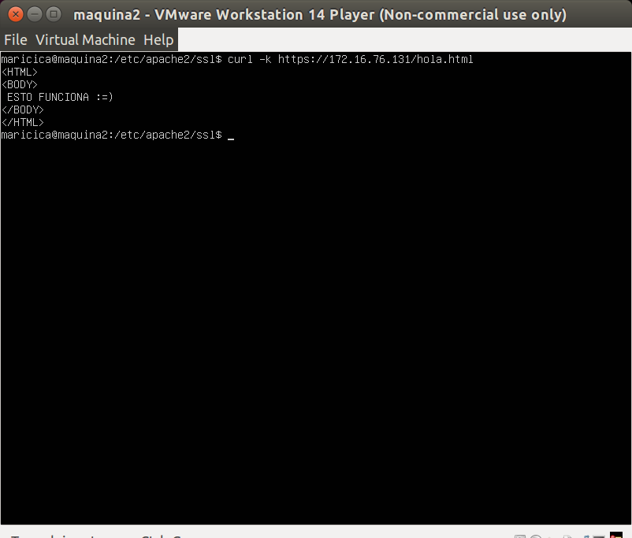

#### Balanceador 

	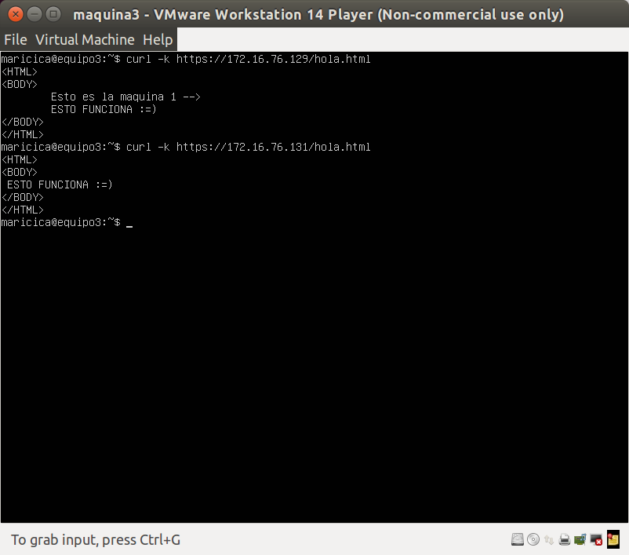

### Configuración del cortafuego 

Comprobamos el estado del cortafuegos:
> iptables -L -n -v 

	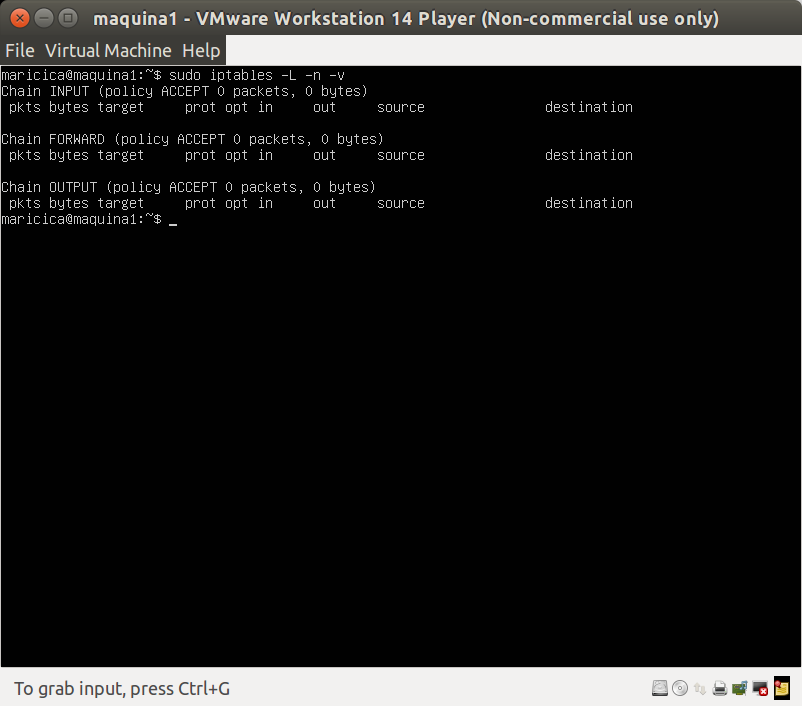

Como se puede observar no hay ningún tipo de configuración y permite todo el tráfico. 

Creamos un script llamado script_reset.sh que se encarga de crear las reglas del contrafuegos poninedo la configuración que tenía la máquina inicialmente, permitiendo todo el trafico. 

	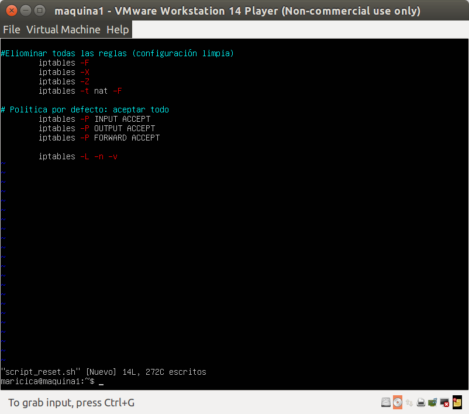

Creamos otro script con una configuración básica: 

	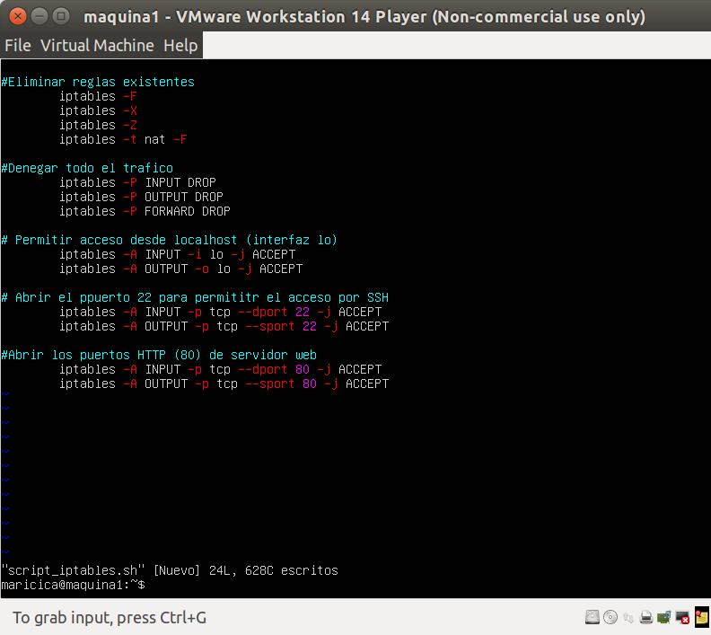

> iptables -L -n -v 

	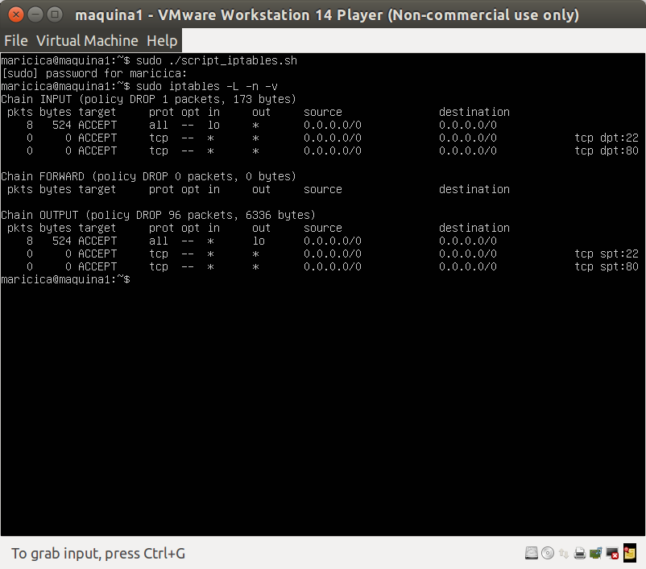

Como se puede observar tanto las conexiones de entrada como las de salida están abiertos los puertos 80 y 22. 

#### Script con reglas que se ejecute al arranque del sistema 

Editamos el archivo rc.local y añadimos la ruta del script creado anteriormente (script_iptables.sh)

> sudo vim /etc/crontab 
Añadimos 
> @reboot /home/maricica/script_iptables.sh 

	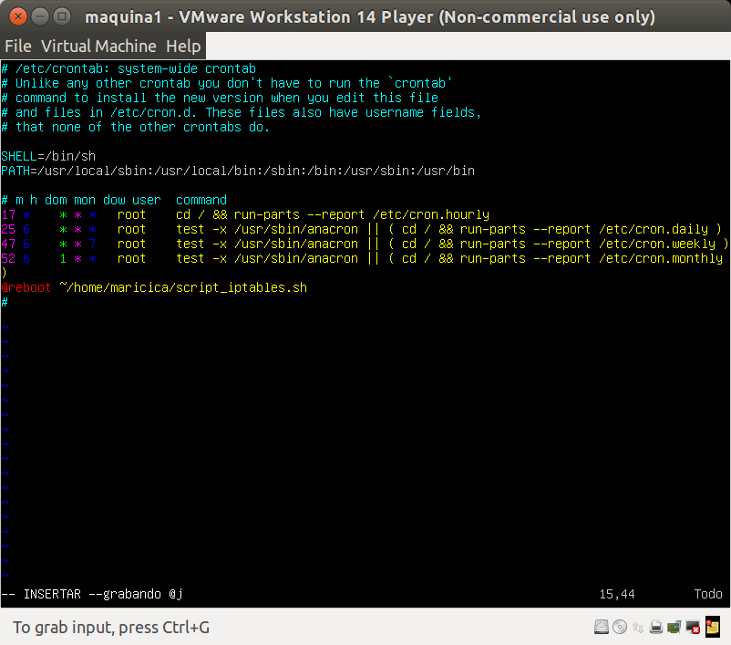

