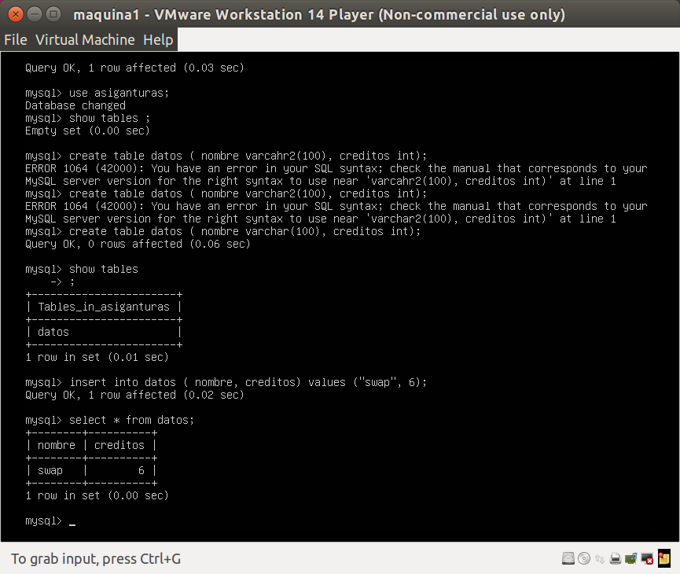
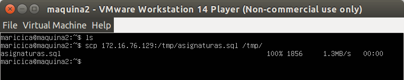
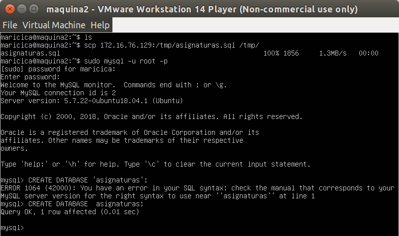
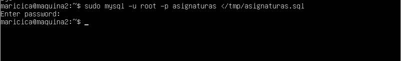
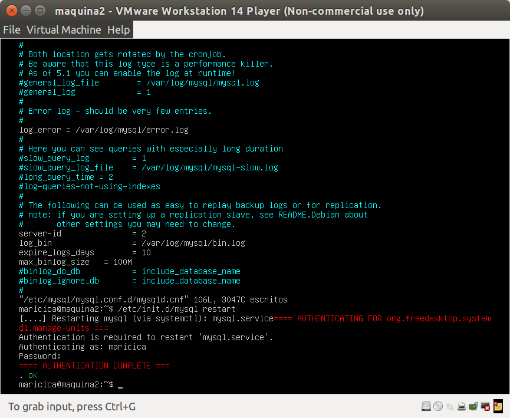
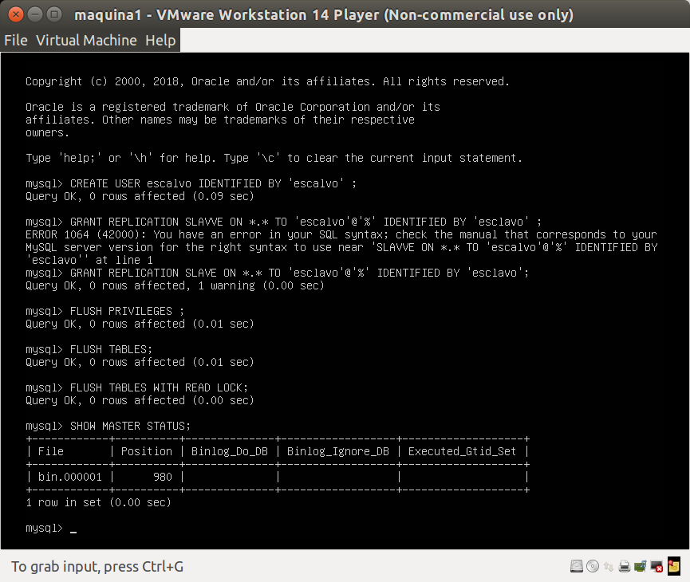
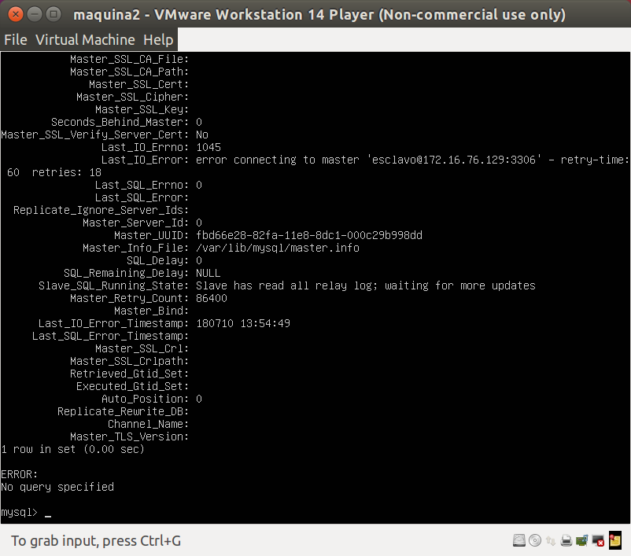

## Práctica 5. Replicación de bases de datos MySQL 

Los objetivos concretos de esta práctica son:
- Copiar archivos de copia de seguridad mediante ssh.
- Clonar manualmente BD entre máquinas.
- Configurar la estructura maestro-esclavo entre dos máquinas para realizar el clonado automático de la información.

### Crear una BD e insertar datos 

Entramos en MySQL 

> mysql -uroot -p 

Creamos una BD

> create database asiganturas; 

> use asiganturas; 

> create table datos (nombre varcahr(100), creditos int); 

> insert into datos (nombre, creditos) values ("swap", 6); 

	

### Replicar una BD MySQL con mysqldump 

Esto puede ser suficiente, pero tenemos que tener en cuenta que los datos pueden estar actualizándose constantemente en el servidor de BD principal. En este caso, antes de hacer la copia de seguridad en el archivo .SQL debemos evitar que se acceda a la BD para cambiar nada.

> mysql -u root –p
> mysql> FLUSH TABLES WITH READ LOCK;
> mysql> quit

Ahora ya sí podemos hacer el mysqldump para guardar los datos. En el servidor
principal (maquina1) hacemos:
> mysqldump asiganturas-u root -p > /tmp/asignaturas.sql

Como habíamos bloqueado las tablas, debemos desbloquearlas (quitar el “LOCK”):
> mysql -u root –p
> mysql> UNLOCK TABLES;
> mysql> quit

Ya podemos ir a la máquina esclavo (maquina2, secundaria) para copiar el archivo
.SQL con todos los datos salvados desde la máquina principal (maquina1):
> scp maquina1:/tmp/ejemplodb.sql /tmp/
y habremos copiado desde la máquina principal (1) a la máquina secundaria (2) los
datos que hay almacenados en la BD.

	

Con el archivo de copia de seguridad en el esclavo ya podemos importar la BD
completa en el MySQL. Para ello, en un primer paso creamos la BD:
> mysql -u root –p
> mysql> CREATE DATABASE ‘ejemplodb’;
> mysql> quit

	

Y en un segundo paso restauramos los datos contenidos en la BD (se crearán las
tablas en el proceso):
> mysql -u root -p asignaturas < /tmp/asignaturas.sql

	

### Replicación de BD mediante una configuración maestro-escalvo 

La opción anterior funciona perfectamente, pero es algo que realiza un operador a
mano. Sin embargo, MySQL tiene la opción de configurar el demonio para hacer
replicación de las BD sobre un esclavo a partir de los datos que almacena el maestro.

Se trata de un proceso automático que resulta muy adecuado en un entorno de
producción real. Implica realizar algunas configuraciones, tanto en el servidor principal como en el secundario.

Lo primero que debemos hacer es la configuracion de mysql del maestro. Para ello editamos, como root, el archivo /etc/mysql/mysql.conf.d/mysqld.cnf.

Comentamos el siguiente parámetro que sirve para que escuche a un servidor:

> #bind-address 127.0.0.1

Le indicamos donde tiene que almacenar el log de errores:

> log_error = /var/log/mysql/error.log

Establecemos el identificador del servidor:

> server-id = 1

El registro binario contiene toda la información que está disponible en el registro de actualizaciones, en un formato más eficiente y de una manera que es segura para las transacciones:

> log_bin = /var/log/mysql/bin.log

Guardamos el documento y reiniciamos el servicio:

> /etc/init.d/mysql restart

	

Si no nos ha dado ningún error la configuración del maestro, podemos pasar a hacer
la configuración del mysql del esclavo (editar como root su archivo de configuración).

Hacemos la configuaración del esclavo exactamente igual que antes pero cambiando el
> server-id = 2

Reiniciamos el servicio en el esclavo:
> /etc/init.d/mysql restarty 

	

una vez más, si no da ningún error, habremos tenido éxito. Podemos volver al maestro para crear un usuario y darle permisos de acceso para la replicación.

Entramos en mysql y ejecutamos las siguientes sentencias:
> mysql> CREATE USER esclavo IDENTIFIED BY 'esclavo';
> mysql> GRANT REPLICATION IDENTIFIED BY 'esclavo'; SLAVE ON *.* TO 'esclavo'@'%'
> mysql> FLUSH PRIVILEGES;
> mysql> FLUSH TABLES;
> mysql> FLUSH TABLES WITH READ LOCK;

> mysql> SHOW MASTER STATUS;

	

Ahora nos vamos a la maquina del esclavo (maquina2) y le indicamos los datos del maestro y reiniciamos:

> CHANGE MASTER TO MASTER_HOST='192.168.56.105', MASTER_USER='esclavo', MASTER_PASSWORD='esclavo', MASTER_LOG_FILE='mysql-bin.000001', MASTER_LOG_POS=980, MASTER_PORT=3306;

> START SLAVE;

Por último, volvemos al maestro y volvemos a activar las tablas para que puedan meterse nuevos datos en el maestro:

> sudo mysql -u root -p
> mysql > UNLOCK TABLES;

si queremos asegurarnos de que todo funciona perfectamente y que el esclavo
no tiene ningún problema para replicar la información, nos vamos al esclavo y con la
siguiente orden:

> mysql> SHOW SLAVE STATUS\G

	

